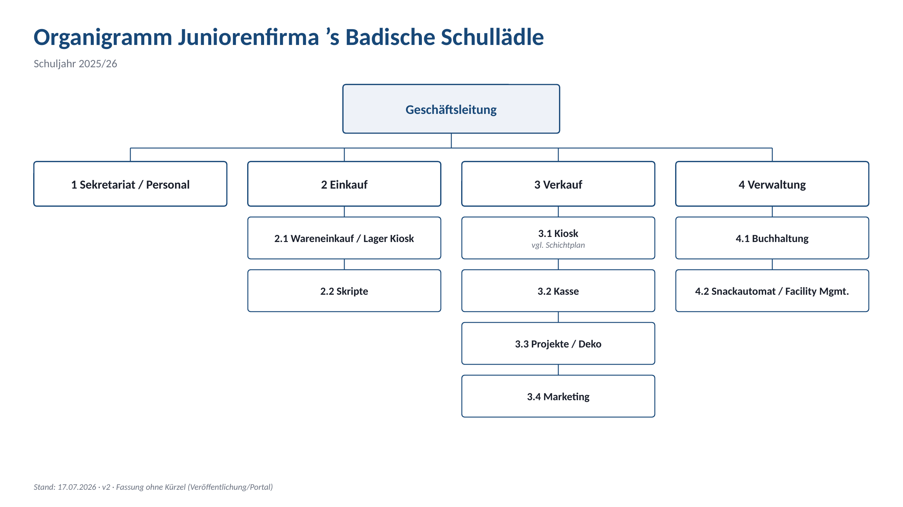

# Organisation

So ist das Schullädle organisiert – vier Abteilungen unter der Geschäftsleitung:

Die ausführlichen Prozessbeschreibungen der Abteilungen findet ihr über die Navigation
(Abteilung 1 – Sekretariat / Personal und Abteilung 2.1 – Wareneinkauf / Lager;
weitere Abteilungen folgen).

*Wer in welchem Team arbeitet, erfahrt ihr im Unterricht – hier im Portal stehen
wie immer keine Namen.*
